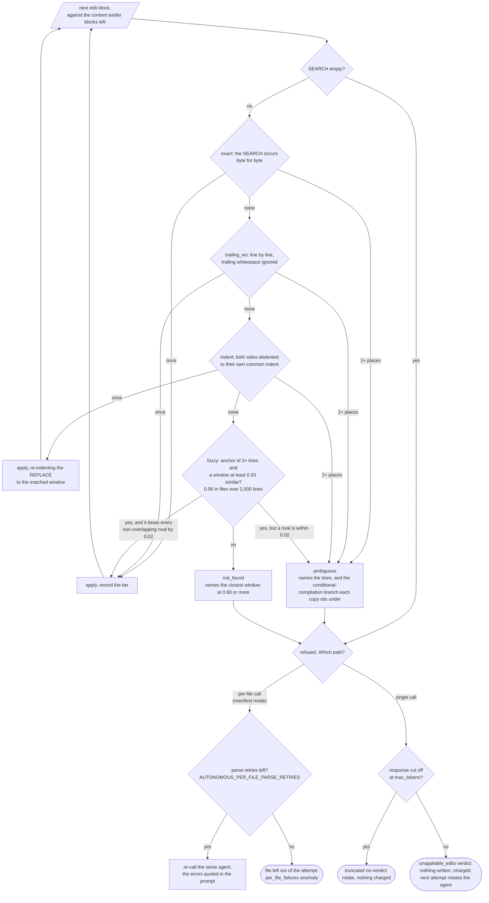

# How the implementer edits existing files

A file that already exists in the repository is not re-emitted. The
implementer sends anchored SEARCH/REPLACE blocks, and the pipeline applies
them mechanically (DEV-581). New files are still written whole. This page is
the reference for that path: what the parser accepts, how a block finds its
place, and what happens when it cannot.

The code is in two places. `coding_model_autonomous/apply_edits.py` is pure:
it parses and applies, reads no files and logs nothing. The daemon decides
which files are editable and routes failures (`_resolve_edit_mode_response`,
`_generate_one_file` and `_route_unappliable_edits` in
`orchestrator_daemon.py`). The prompt text the model sees is
`IMPLEMENTER_EDIT_MODE_INSTRUCTIONS` and `PER_FILE_EDIT_MODE_INSTRUCTIONS` in
`executor.py`.

Where this sits in the pipeline: [PIPELINE.md](PIPELINE.md) section 4 (the
single-call and manifest fork) and section 6 (what a verdict costs).

---

## 1. What counts as an existing file

The set the prompt shows under "Current contents of files you must modify" is
the set the applier edits against. `resolve_edits` takes it as `existing`,
and membership there is the only test of "this file exists". The prompt and
the applier cannot disagree about it.

That set is the declared modification set at `base_ref` (PIPELINE.md section
8), after the prompt budget has had its say: a file the allocator dropped is
not shown, so it cannot be edited. From retry 1 in single-call mode, a planned
NEW file that an earlier attempt wrote is served from the newest
`retry_history/` snapshot as editable too (`_prior_new_files_as_editable`,
DEV-790).

Edit mode arms only when the switch is on **and** at least one existing file
was supplied. When the spec names existing files but none arrived, the daemon
logs "edit mode DISARMED" and the attempt re-emits whole files.

---

## 2. The grammar

`parse_edit_blocks` scans the response line by line. It never raises: a
structurally broken block becomes a `malformed` entry, and anything that is
not a header or a block is ignored, so prose between blocks is harmless.

| Form | Minimal example | Rules |
|---|---|---|
| **Whole file** (new files) | `<<<FILE: src/new.py>>>` `print("hi")` `<<<END_FILE>>>` | Parsed by `executor.parse_implementer_response`, not by `apply_edits`. One to three angle brackets, case-insensitive. A markdown fence around the body is stripped. The last block for a path wins. |
| **File header** | `### src/app.py` | Two to four `#`, then the path. Backticks and a leading `/` are stripped. Sets the target for the blocks that follow. Recognised only outside a block body, so a `###` line inside a REPLACE is content. A header with no blocks after it is dropped. |
| **SEARCH/REPLACE block** | `<<<<<<< SEARCH` `x = 1` `=======` `x = 2` `>>>>>>> REPLACE` | Each marker must own its line; leading whitespace is allowed. Five or more `<`, `=` or `>` are accepted, since models miscount the seven. The `SEARCH` and `REPLACE` labels are optional. Bodies are kept verbatim, minus the final newline. |
| **Deletion** | `<<<<<<< SEARCH` `debug()` `=======` `>>>>>>> REPLACE` | An empty REPLACE deletes the searched lines. |
| **FILE-wrapped edit set** (DEV-770) | `<<<FILE: Package.swift>>>` `<<<<<<< SEARCH` … `>>>>>>> REPLACE` `<<<END_FILE>>>` | A FILE marker around blocks for an **existing** path is read as that file's header, and the whole-file body is discarded rather than written with markers in it. `<<<END_FILE>>>` clears the target, so a later stray block is not attributed to it. |
| **Empty SEARCH on a new path** (DEV-638) | `### src/new.py` `<<<<<<< SEARCH` `=======` `print("hi")` `>>>>>>> REPLACE` | Exactly one block, empty SEARCH, a path not in the existing set: taken as the whole new file. Recorded as tier `whole_from_empty_search`. |

Several blocks per file are allowed. They apply in order, each against the
content the previous one left.

What the parser and the resolver refuse, with the `reason` recorded on each
failure (`EditFailure`):

| Reason | Cause |
|---|---|
| `malformed` | a SEARCH with no `=======`, a block with no REPLACE terminator, or a block with no header before it |
| `empty_search` | an empty SEARCH against an existing file; it would match everywhere |
| `no_base` | edit blocks for a path that is not an existing file. The message says "EMIT WHOLE" |
| `placeholder_path` | edit blocks for one of the prompt's own example paths (DEV-690). The message says to drop the block, not to emit it whole, because the artifact ledger refuses placeholder paths |
| `not_found` | no ladder tier found the SEARCH (below) |
| `ambiguous` | a tier found it in more than one place |

---

## 3. The match ladder

`apply_search_replace` tries four tiers in order, and a tier runs only when
the one before it found nothing (DEV-638). A tier that finds **more than one**
place refuses at once. It never falls through, because every later tier is
looser and would only make the ambiguity worse.

The fuzzy tier's window is the anchor's line count, and one line either side
for anchors of six lines or more, which covers a dropped or duplicated line.
The floor sits just under what one dropped line costs a 9-line anchor (about
0.94), so that slip still lands in a 6,000-line file. The constants are at the
top of the tier code in `apply_edits.py` (`FUZZY_RATIO`, `FUZZY_RATIO_LARGE`,
`FUZZY_MARGIN`, `FUZZY_MIN_LINES`, `FUZZY_SIZE_SLACK_MIN_LINES`); none is an
env var.

A landed block that was not an exact match is not silent. The attempt's
`agent_ran` event carries `edit_tiers` (a count per tier) and
`edit_applies_nonexact`, and the next `code_review` gate lists every non-exact
apply with its similarity, so a human can check the diff at each one.

### What an unappliable attempt costs

In single-call mode the resolve is all or nothing: when any block fails,
nothing from the response is written (`ResolveResult.errors` non-empty). The
daemon then:

1. Checks for truncation first. A response cut off at `max_tokens`
   degenerates into garbage anchors, so it is a `truncated` no-verdict that
   rotates the agent without a charge (DEV-623).
2. Otherwise calls `_route_unappliable_edits`. It records an `agent_ran` row
   with `anomaly: "unappliable_edits"`, the first line of each error, and
   `errors_full` holding the **complete** SEARCH text of up to eight failed
   blocks (DEV-637).
3. Hands an `unappliable_edits` verdict to `outcome.dispose`. That is an
   ordinary verdict: charged against `MAX_RETRIES`, a synthetic rejected
   `code_review` gate carries `_edit_apply_feedback` to the retry, and the
   next attempt's agent comes from the rotation (PIPELINE.md section 7). At
   exhaustion it reaches synthesis like every other verdict.

For invariance detection an unappliable edit is keyed on class, phase and
file only (`outcome.coarse_key`). The block number and similarity score in
its detail change from attempt to attempt and are deliberately left out, so
two agents failing to anchor in the same file count as the same failure.

In manifest mode each file is its own call, and a refusal is retried inside
that call up to `AUTONOMOUS_PER_FILE_PARSE_RETRIES` (2) times with the errors
quoted back. A per-file call that re-emits an oversized existing file whole
is refused the same way. A truncated per-file call gives up at once, since
the same agent would only truncate again. A file that never applies is left
out of the attempt; the manifest-mode missing-file handling in PIPELINE.md
section 8 takes it from there.

---

## 4. The switches

### `AUTONOMOUS_DIFF_BASED_EDITS` (default `1`)

Read once at import into `executor.DIFF_BASED_EDITS`. With it on, existing
files get edit blocks as above. With `0`, every file is re-emitted whole: the
edit-mode instructions are not appended, the retry feedback says "re-emit"
rather than "edit" (`_reemit_instruction`), and the implement path is the
pre-DEV-581 one.

`0` is kept as DEV-581's rollback lever, not as a supported mode. The seam
tests pin both sides: `tests/seams/conftest.py` sets it off for every seam
test, and its `edit_mode` fixture turns it on for the tests that exercise
this page. Production has run with it on since DEV-581.

### `AUTONOMOUS_MANIFEST_WHOLE_FILE_MAX_CHARS` (default `40000`)

A per-file call has an output budget of `AUTONOMOUS_PER_FILE_MAX_TOKENS`
(16,000 tokens). A large existing file cannot be re-emitted whole inside it:
runs 18 and 19 shipped 33 of 117 lines and 43 of 5,804. So when a manifest
entry already exists, edit mode is **off**, and its current content is over
this many characters, `_generate_one_file` refuses the entry instead of
generating a fragment (DEV-604). The refusal is logged by name and recorded
as an `oversized_whole_file_refused` anomaly, and the error message names
both switches. `0` disables the check.

With edit mode on, an oversized file is edited normally; the limit applies
only if the model re-emits it whole anyway, and that response is rejected
and retried.

Synthesis has no edit mode at all. It emits whole files, and its version of
this limit is `AUTONOMOUS_SYNTHESIS_EMIT_HEADROOM` (DEV-649; PIPELINE.md
section 8).

Both switches are in [CONFIGURATION.md](CONFIGURATION.md) with the rest of
the implementer knobs.
