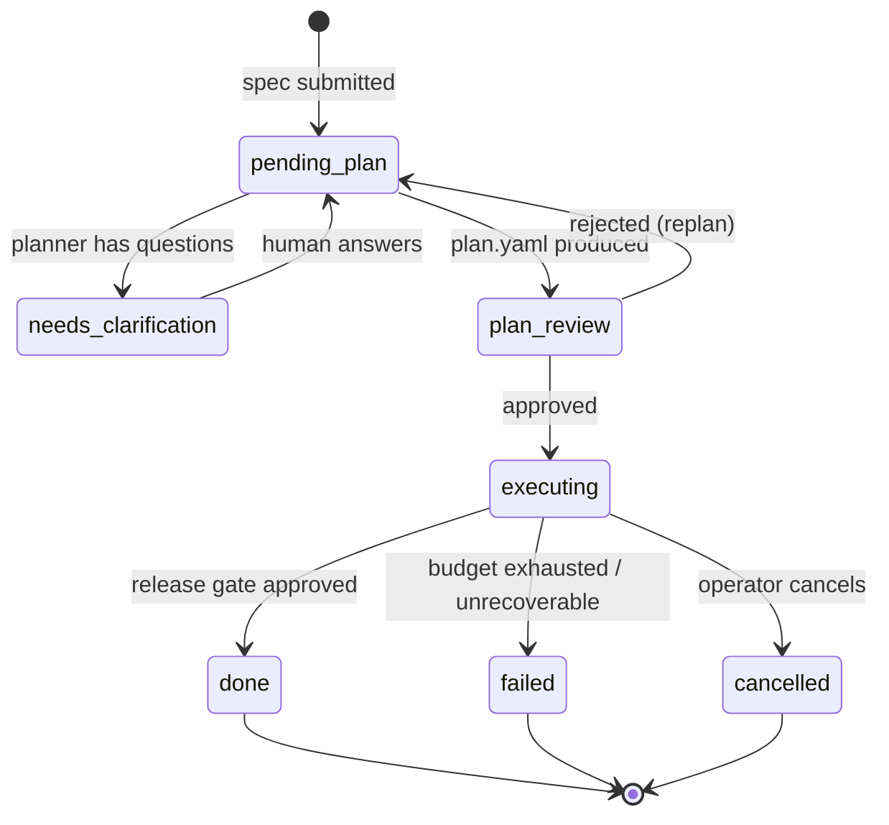
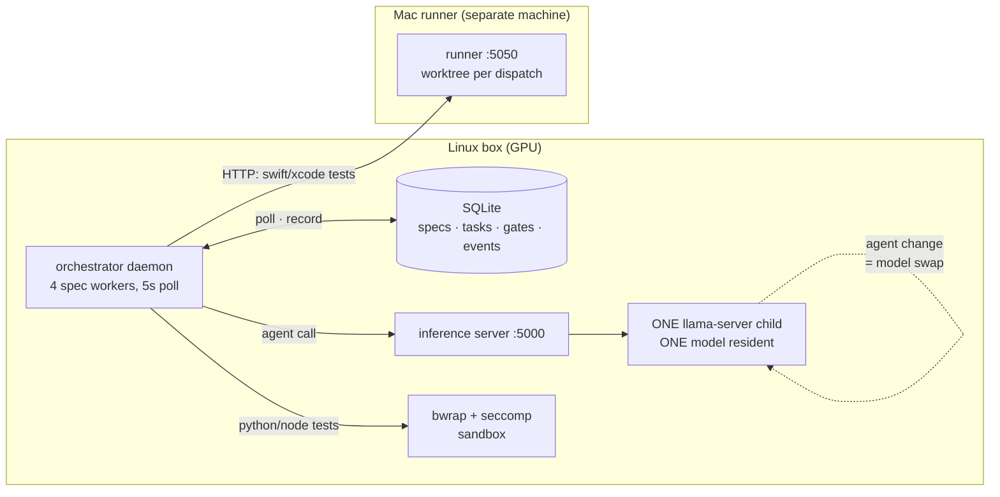
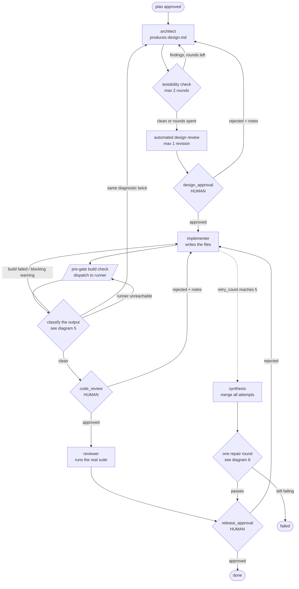
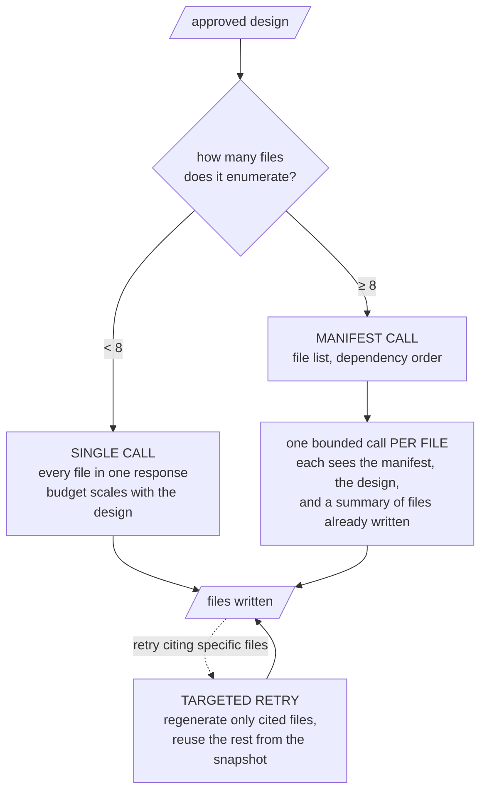
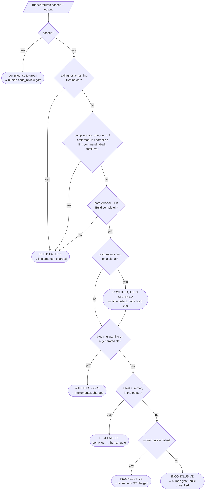
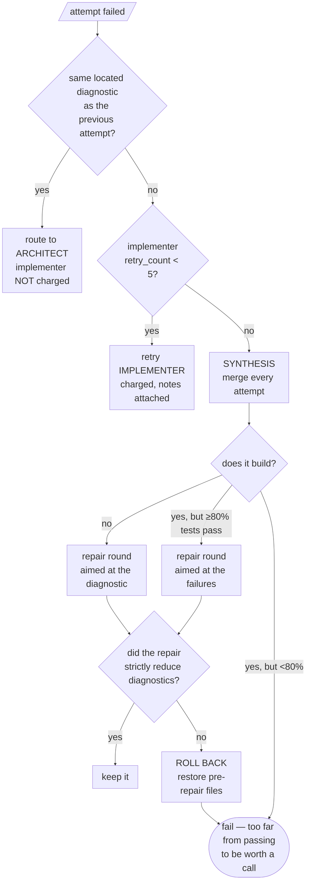

# How the autonomous pipeline works

A spec goes in as markdown; code comes out, or the run fails with a reason. This
document is the map.

**Is it a state machine?** Partly. The lifecycle below is a genuine state
machine and diagram 1 is the whole of it. But two things drive behaviour that a
state machine cannot express, and they are where the complexity actually lives:

- **The transition is chosen by a classifier, not by the state.** One test
  dispatch produces output that is sorted into six outcomes, and the outcome
  decides where control goes. Same state, same event, six destinations
  (diagram 5).
- **Budgets are orthogonal counters that gate transitions.** The same state and
  the same event lead to different places depending on a counter that is
  nowhere in the state (the budget table, and diagram 6).

So: a state machine for the spine, a decision tree for the diagnosis, and a
table for the accounting. Any one of the three alone is misleading.

One more thing the diagrams cannot show, so read it before them: **specs are
not isolated from each other.** Section 2 explains why.

---

## 1. Spec lifecycle

The outer state machine. One spec, one row in `specs`, these statuses.



`plan_review` is also entered automatically when plan validation rejects the
plan itself — up to `PLAN_VALIDATION_MAX_ROUNDS` (2) times, with no human
involved. A third failure fails the spec before anyone sees it.

---

## 2. Topology: three processes, one GPU

Every diagram after this one draws a single spec as if it had the machine to
itself. It does not, and the contention is the constraint most likely to
surprise you.



Three consequences that shape everything else:

- **One model is resident at a time.** Each agent maps to a model; switching
  agents SIGTERMs the llama-server child, waits for the GPU to actually release
  VRAM, and launches the next. A swap requested while another request is in
  flight is refused with a 503 rather than killing the live request.
- **Four spec workers share that one GPU.** They are concurrent in the
  orchestrator and serialised at the model. The practical rule: **do not run two
  specs at once.** The client retries a deferred swap on a 10/30/60s backoff,
  which was sized for VRAM release — but a swap deferred behind *another spec's
  generation* waits 10–20 minutes, outlasts the backoff, and can fail the second
  spec outright.
- **The build is not local.** Swift and Xcode work is dispatched over HTTP to a
  runner on another machine, which materialises a git worktree per dispatch,
  applies the generated files, runs the suite once, and returns the output. That
  boundary is why "runner unreachable" is a distinct outcome in diagram 5, and
  why a sleeping laptop is an infrastructure fault rather than a verdict on the
  code. Python and Node suites run locally instead, confined by bubblewrap with
  a seccomp filter, because they are LLM-written code executing on the host.

---

## 3. Inside `executing`: three tasks, four gates

`executing` bootstraps three tasks — architect, implementer, reviewer — which
run in order. Each has its own `retry_count`. Human gates are the diamonds.



Two edges are worth naming because they are the ones people miss:

- **`CLASS --> ARCH`** is the upstream route. When the same *located* diagnostic
  survives repeated implementer attempts, the implementer is not the author of
  the defect — the design is, and the design is re-read unchanged on every
  retry, so no number of implementer attempts can converge. The implementer is
  not charged for that attempt.
- **`IMPL -.-> SYNTH`** is the escape hatch. Exhausting the retry budget does
  not fail the spec; the accumulated attempts are merged, because the union of
  six near-misses is often closer to correct than any single one of them.

---

## 4. How the implementer writes files

"Implementer runs" hides a fork with real consequences for what can go wrong.



The fork exists because one capped response cannot hold a large project. The
cost is that per-file calls each see a *summary* of their siblings rather than
their source, so inter-file contracts can drift — a method renamed in file 3
that file 9 still calls. Targeted retry has the mirror problem: reusing
uncited files is what makes a retry affordable, and also what lets a defect in
an uncited file survive every attempt. When a diagnostic cites only test files
but the real fault is in the module, the retry regenerates the tests forever.
That is why the upstream route in diagram 6 exists.

`AUTONOMOUS_IMPLEMENTER_MODE` forces `single` or `manifest` if you need to pin
it; the default decides per design at a threshold of 8 files.

---

## 5. Classifying one test dispatch

This is the part a state machine cannot draw. A single runner call returns
`(passed, output)`, and *six* different conclusions can follow. Order matters —
each check exists because a real run was misdiagnosed without it.



Why each branch exists, since every one of them is a scar:

| Branch | The failure it prevents |
|---|---|
| `passed?` first | Some suites legitimately print the word "error"; a green suite proves the build was fine. |
| attributed before driver | Cascade errors in test files are consequences; the module-level cause has no file:line. |
| compile-stage driver errors | `emit-module command failed` is a real build failure with no attribution — it must not be demoted. |
| the `Build complete!` ordering test | The harness prints `error:` long after the build finished. Without this, a run that compiled and then trapped was reported to the model as "your code does not compile". |
| crash as its own outcome | Under a parallel runner one trap takes every test down, so "no summary" is not "we learned nothing". |
| warnings | The compiler frequently names the defect on the exact line and nothing was reading it. |
| unreachable → requeue | A sleeping laptop is not the implementer's mistake, and must not spend its budget. |

---

## 6. Where a failure goes, and who pays

Same failure, three destinations, decided by evidence rather than by state.



The rollback exists because a repair round once fixed the defect it was given
and simultaneously stripped `import Foundation` from every file, taking the
build from 3 errors to 14. Getting the target right is not sufficient.

---

## 7. Budgets

The counters that decide whether a transition is available at all. This is the
table to read first when a run ends somewhere surprising.

| Budget | Default | Env var | What it bounds |
|---|---|---|---|
| `MAX_RETRIES` | 5 | `AUTONOMOUS_MAX_RETRIES` | Per-task retries. Shared by human rejections, automated rotations and crash recovery. |
| Testability rounds | 2 | `AUTONOMOUS_TESTABILITY_CHECK_MAX_ROUNDS` | Architect revisions the testability check may force. |
| Design review revisions | 1 | `AUTONOMOUS_DESIGN_REVIEW_MAX_REVISIONS` | Automated design-review rejections. |
| Plan validation rounds | 2 | `AUTONOMOUS_PLAN_VALIDATION_MAX_ROUNDS` | Automatic replans before the spec fails. |
| Upstream-routing threshold | 1 | `AUTONOMOUS_BUILD_FAILURE_ARCHITECT_THRESHOLD` | Consecutive identical diagnostics before the design is blamed. |
| Unreachable-runner requeues | 3 | — | Consecutive free requeues before escalating to a human. |
| Synthesis repair rounds | 1 | — | Hard-coded. One repair, then the run ends. |
| Repair pass-rate floor | 0.8 | `AUTONOMOUS_SYNTHESIS_REPAIR_MIN_RATE` | Below this, a repair call is not worth making. |
| Parse retries | 2 / 2 | `AUTONOMOUS_ARCHITECT_PARSE_RETRIES`, `AUTONOMOUS_PER_FILE_PARSE_RETRIES` | Malformed agent output before giving up. |

**Three traps in the accounting**, each of which has cost a real run:

1. **`retry_count` is shared.** Human design rejections, the testability check
   and upstream routing all draw on the same counter. Spend three rejections
   arguing about a design and the automatic recovery has nothing left.
2. **Crash recovery charges a retry.** A daemon restart mid-generation costs the
   task an attempt, deliberately — otherwise a call that reliably crashes the
   daemon loops forever. A power cut therefore costs budget.
3. **Architect rejections are uncapped, but crash recovery is not.** Rejecting a
   design re-runs the architect with no `MAX_RETRIES` check, so you can iterate
   as long as you like. What runs out is crash-recovery headroom: past
   `MAX_RETRIES`, a daemon crash during that generation fails the spec outright.

---

## 8. What reaches which agent

Feedback is not symmetric, and the asymmetries are deliberate.

| Channel | Reaches | Notes |
|---|---|---|
| Gate **rejection** notes | The agent being retried | Design rejections → architect; code rejections → implementer. |
| Gate **approval** notes | The *next* role | Design approval → implementer, plan approval → architect, as conditions on an approved artefact — not as a rejection, so it is not invited to redesign. |
| Clarification answers | Planner, then implementer | Rendered at spec authority. |
| Plan `acceptance_criteria` | Architect | Supersede the spec where they differ; a criterion struck from the plan was struck on purpose. |
| Protected files | Architect and implementer, read-only | They are compiled in but must not be edited. Without them, agents redeclare types that already exist. |
| Compiler diagnostics | Implementer, or architect when recurring | See diagram 6. |

---

## 9. Reading a run

```bash
coding-model-autonomous status <spec_id>   # where it is now
coding-model-autonomous events <spec_id>   # every transition, with payloads
coding-model-autonomous gates              # what is waiting on you
```

The `events` table is the audit trail: every agent call, every test dispatch,
every gate, with the payload that drove the decision. When a run ends somewhere
surprising, the answer is almost always a budget in section 7 or a branch in
diagram 5 — in that order.
