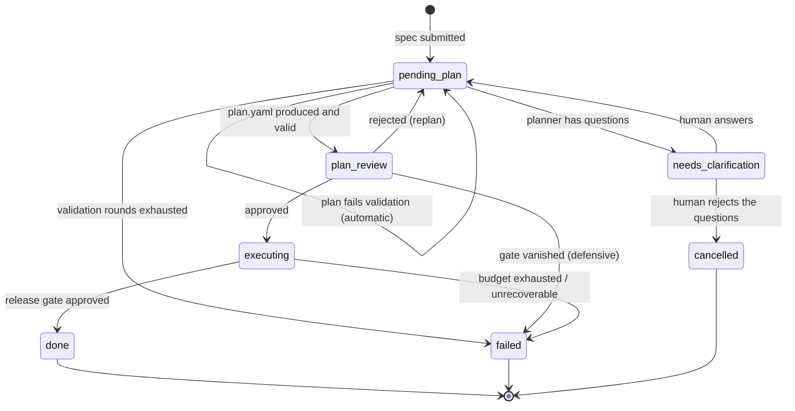
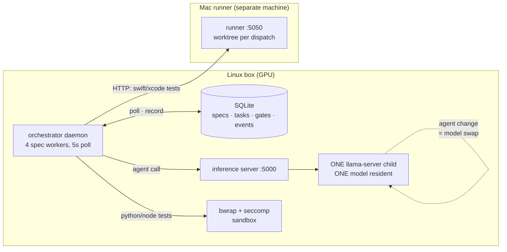
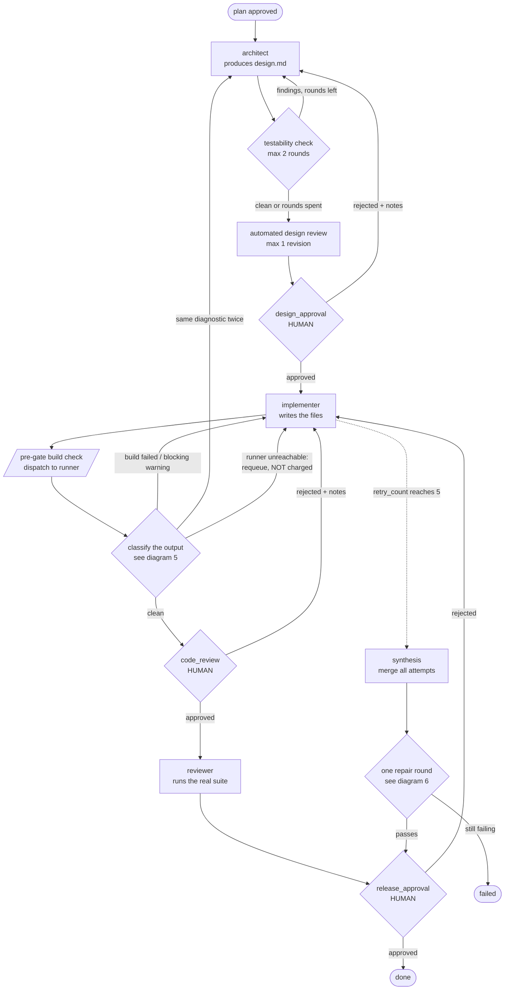
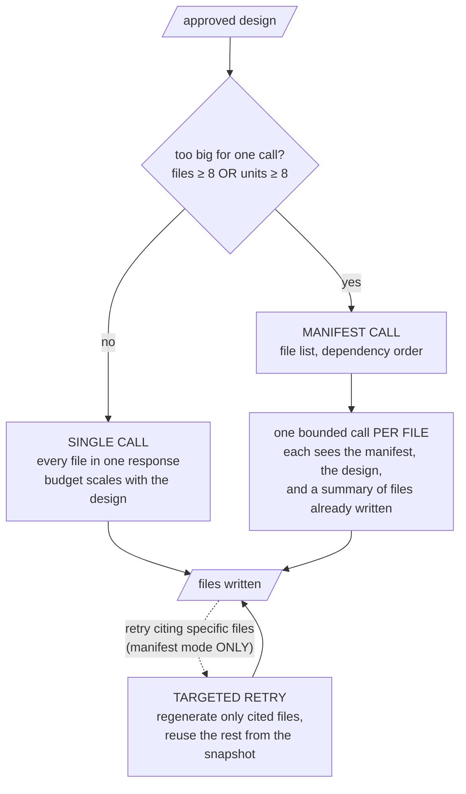
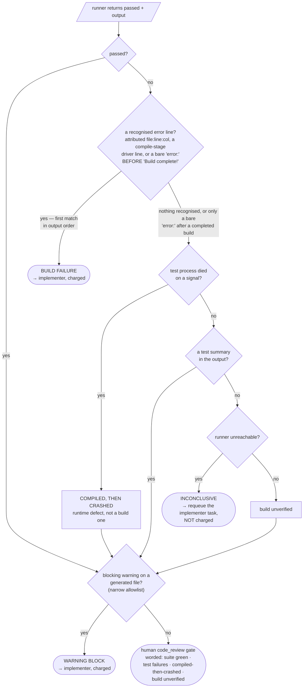
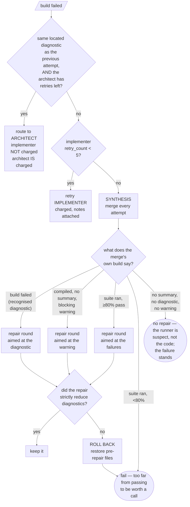

# How the autonomous pipeline works

A spec goes in as markdown; code comes out, or the run fails with a reason. This
document is the map.

**Is it a state machine?** Partly. The lifecycle below is a genuine state
machine and diagram 1 is the whole of it. But two things drive behaviour that a
state machine cannot express, and they are where the complexity actually lives:

- **The transition is chosen by a classifier, not by the state.** One test
  dispatch produces output that is sorted into seven outcomes, and the outcome
  decides where control goes. Same state, same event, seven destinations
  (diagram 5).
- **Budgets are orthogonal counters that gate transitions.** The same state and
  the same event lead to different places depending on a counter that is
  nowhere in the state (the budget table, and diagram 6).

So: a state machine for the spine, a decision tree for the diagnosis, and a
table for the accounting. Any one of the three alone is misleading.

One more thing the diagrams cannot show, so read it before them: **specs are
not isolated from each other.** Section 2 explains why.

---

## 1. Spec lifecycle

The outer state machine. One spec, one row in `specs`, these statuses.



Plan validation runs *before* `plan_review` is ever entered: an invalid plan is
rejected straight back to `pending_plan`, automatically — up to
`PLAN_VALIDATION_MAX_ROUNDS` (2) replans with no human involved. A third
failure fails the spec before anyone sees it.

Note the edge that is **not** there: nothing in the code writes `cancelled`
except a human rejecting a clarification gate. Cancelling a spec that is
already executing takes DB surgery (DEV-493 tracks giving it a real path).

---

## 2. Topology: three processes, one GPU

Every diagram after this one draws a single spec as if it had the machine to
itself. It does not, and the contention is the constraint most likely to
surprise you.



Three consequences that shape everything else:

- **One model is resident at a time.** Each agent maps to a model; switching
  agents SIGTERMs the llama-server child, waits for the GPU to actually release
  VRAM, and launches the next. A swap requested while another request is in
  flight is refused with a 503 rather than killing the live request.
- **Four spec workers share that one GPU.** They are concurrent in the
  orchestrator and serialised at the model. The practical rule remains: **run
  one spec at a time.** A swap refused because another request holds the model
  comes back as a 503 with `Retry-After`, and the client waits it out without
  consuming a retry attempt — only *transport* errors burn attempts, on a
  10/30/60s backoff. The wait is bounded by the per-role call timeout (45 min
  architect, 30 min implementer), so contention behind another spec's
  generation no longer fails the second spec outright (DEV-491); it spends
  wall-clock, and only a generation that outlasts the role timeout fails.
- **The build is not local.** Swift and Xcode work is dispatched over HTTP to a
  runner on another machine, which materialises a git worktree per dispatch,
  applies the generated files, runs the suite once, and returns the output. That
  boundary is why "runner unreachable" is a distinct outcome in diagram 5, and
  why a sleeping laptop is an infrastructure fault rather than a verdict on the
  code. Python and Node suites run locally instead, confined by bubblewrap with
  a seccomp filter, because they are LLM-written code executing on the host.

---

## 3. Inside `executing`: tasks and gates

`executing` bootstraps one task per phase in `plan.yaml` — in practice three:
architect, implementer, reviewer — run in order, each with its own
`retry_count`. Three human gate types live inside `executing`
(`design_approval`, `code_review`, `release_approval`); clarification and plan
approval have already happened by now. The diamonds marked HUMAN are human;
the testability check and the classifier are automated.



Two edges are worth naming because they are the ones people miss:

- **`CLASS --> ARCH`** is the upstream route. When the same *located* diagnostic
  survives repeated implementer attempts, the implementer is not the author of
  the defect — the design is, and the design is re-read unchanged on every
  retry, so no number of implementer attempts can converge. The implementer is
  not charged for that attempt.
- **`IMPL -.-> SYNTH`** is the escape hatch. Exhausting the retry budget does
  not fail the spec; the accumulated attempts are merged, because the union of
  six near-misses is often closer to correct than any single one of them.
- **`CLASS --> IMPL` on runner-unreachable** re-runs the whole implementer
  generation: the task is set back to PENDING, uncharged. There is no way to
  re-run just the build check, so a free requeue still costs a full generation
  of wall-clock — which is why the requeue budget in section 7 is small.

---

## 4. How the implementer writes files

"Implementer runs" hides a fork with real consequences for what can go wrong.



The fork exists because one capped response cannot hold a large project. The
cost is that per-file calls each see a *summary* of their siblings rather than
their source, so inter-file contracts can drift — a method renamed in file 3
that file 9 still calls. Targeted retry — which only exists in manifest mode,
since it needs the prior run's manifest to know what to reuse — has the mirror
problem: reusing uncited files is what makes a retry affordable, and also what
lets a defect in an uncited file survive the attempt. When a diagnostic cites
only test files but the real fault is in the module, a targeted retry
regenerates the wrong files. Two guards bound that: after
`AUTONOMOUS_TARGETED_RETRY_MAX_REPEATS` (1) targeted attempts fail on the
identical diagnostic, the next retry widens to a full regeneration — and notes
carrying any *unattributed* error widen it immediately. The upstream route in
diagram 6 exists for the same problem one level up, where widening the retry
cannot help because the defect is in the design.

`AUTONOMOUS_IMPLEMENTER_MODE` forces `single` or `manifest` if you need to pin
it; the default (`auto`) takes manifest mode when the design enumerates
`AUTONOMOUS_MANIFEST_FILE_THRESHOLD` (8) or more files — or 8 or more declared
units, the guard for designs whose file list understates their size.

---

## 5. Classifying one test dispatch

This is the part a state machine cannot draw. A single runner call returns
`(passed, output)`, and *seven* different conclusions can follow. Order
matters — each check exists because a real run was misdiagnosed without it.



The warning check is a final intercept, not a branch of its own: it is
consulted on every path where nothing failed to compile — including a green
suite — because a blocking warning is the compiler proving the code contradicts
itself regardless of what the tests said. The requeue is the one exit that
bypasses it: no code reached the compiler, so there is nothing to intercept.

Why each branch exists, since every one of them is a scar:

| Branch | The failure it prevents |
|---|---|
| `passed?` first | Some suites legitimately print the word "error"; a green suite proves the build was fine. |
| one scan for attributed *and* driver lines | Both are recognised in a single pass over the output — whichever appears first wins, and both mean BUILD FAILURE. The driver patterns (`emit-module` / `compile` / `link command failed`, `fatalError`) exist because a module-level cause has no `file:line` to attribute, and must not be demoted for it. |
| the `Build complete!` ordering test | The harness prints `error:` long after the build finished. Without this, a run that compiled and then trapped was reported to the model as "your code does not compile". |
| crash as its own outcome | Under a parallel runner one trap takes every test down, so "no summary" is not "we learned nothing". |
| warnings, narrow allowlist | The compiler frequently names the defect on the exact line and nothing was reading it. Only the allowlist blocks — unused value/binding, unreachable code, always-true/false comparison; style warnings are recorded but never block. `AUTONOMOUS_BLOCK_ON_BUILD_WARNINGS=0` turns the whole intercept off. |
| unreachable → requeue | A sleeping laptop is not the implementer's mistake, and must not spend its budget. |

---

## 6. Where a failure goes, and who pays

Same failure, three destinations, decided by evidence rather than by state.



Two preconditions the boxes cannot hold: the upstream route needs an architect
task to exist *with retries left* — otherwise the failure falls through to an
ordinary, charged implementer retry — and a WARNING BLOCK never takes the
upstream route at all; only build failures do. "Not charged" refers to the
implementer: the architect's own `retry_count` is incremented for every routed
failure, which is what stops the loop from being free.

The rollback exists because a repair round once fixed the defect it was given
and simultaneously stripped `import Foundation` from every file, taking the
build from 3 errors to 14. Getting the target right is not sufficient.

---

## 7. Budgets

The counters that decide whether a transition is available at all. This is the
table to read first when a run ends somewhere surprising.

| Budget | Default | Env var | What it bounds |
|---|---|---|---|
| `MAX_RETRIES` | 5 | `AUTONOMOUS_MAX_RETRIES` | Per-task retries. Shared by human rejections, automated rotations and crash recovery. |
| Testability rounds | 2 | `AUTONOMOUS_TESTABILITY_CHECK_MAX_ROUNDS` | Architect revisions the testability check may force. |
| Design review revisions | 1 | `AUTONOMOUS_DESIGN_REVIEW_MAX_REVISIONS` | Automated design-review rejections. |
| Plan validation rounds | 2 | `AUTONOMOUS_PLAN_VALIDATION_MAX_ROUNDS` | Automatic replans before the spec fails. |
| Upstream-routing threshold | 1 | `AUTONOMOUS_BUILD_FAILURE_ARCHITECT_THRESHOLD` | Consecutive identical diagnostics before the design is blamed. |
| Unreachable-runner requeues | 3 | — | Free requeues before escalating to a human — counted across the spec's last 20 test dispatches, *not* consecutively. Three scattered outages exhaust it the same as three in a row. |
| Synthesis repair rounds | 1 | — | Hard-coded. One repair, then the run ends. |
| Repair pass-rate floor | 0.8 | `AUTONOMOUS_SYNTHESIS_REPAIR_MIN_RATE` | Below this, a repair call is not worth making. |
| Parse retries | 2 / 2 | `AUTONOMOUS_ARCHITECT_PARSE_RETRIES`, `AUTONOMOUS_PER_FILE_PARSE_RETRIES` | Malformed agent output before giving up. |
| Warning blocking | on | `AUTONOMOUS_BLOCK_ON_BUILD_WARNINGS` | The whole WARNING BLOCK intercept in diagram 5. `0` disables it. |
| Targeted-retry repeats | 1 | `AUTONOMOUS_TARGETED_RETRY_MAX_REPEATS` | Identical targeted failures before the retry widens to a full regeneration. |
| Manifest threshold | 8 | `AUTONOMOUS_MANIFEST_FILE_THRESHOLD` | Files (or declared units) a design enumerates before the implementer forks to manifest mode (diagram 4). |
| Supervisor transitions | 8 | `AUTONOMOUS_MAX_SUPERVISOR_TRANSITIONS` | Budget for the supervisor, which is **off by default** (`AUTONOMOUS_SUPERVISOR=0`). When enabled, it replaces the fixed rejection edges in diagram 3 with an agent decision; nothing else in this document changes. |

**Three traps in the accounting**, each of which has cost a real run:

1. **`retry_count` is shared.** Human design rejections, the testability check
   and upstream routing all draw on the same counter. Spend three rejections
   arguing about a design and the automatic recovery has nothing left.
2. **Crash recovery charges a retry.** A daemon restart mid-generation costs the
   task an attempt, deliberately — otherwise a call that reliably crashes the
   daemon loops forever. A power cut therefore costs budget.
3. **Architect rejections are uncapped, but crash recovery is not.** Rejecting a
   design re-runs the architect with no `MAX_RETRIES` check, so you can iterate
   as long as you like. What runs out is crash-recovery headroom: past
   `MAX_RETRIES`, a daemon crash during that generation fails the spec outright.

---

## 8. What reaches which agent

Feedback is not symmetric, and the asymmetries are deliberate.

| Channel | Reaches | Notes |
|---|---|---|
| Gate **rejection** notes | The agent being retried | Design rejections → architect; code rejections → implementer. |
| Gate **approval** notes | The *next* role | Design approval → implementer, plan approval → architect, as conditions on an approved artefact — not as a rejection, so it is not invited to redesign. |
| Clarification answers | Planner, then implementer | Rendered at spec authority. |
| Plan `acceptance_criteria` | Architect | Supersede the spec where they differ; a criterion struck from the plan was struck on purpose. |
| Protected files | Architect and implementer, read-only | They are compiled in but must not be edited. Without them, agents redeclare types that already exist. |
| Compiler diagnostics | Implementer, or architect when recurring | See diagram 6. |

---

## 9. Invariants worth knowing before you change anything

Four rules that are not visible in any diagram and that the code depends on.

**Feedback channels are consumed exactly once.** A design rejection is written
to `design_review_feedback.md`, read by the next architect run, and **deleted on
read**. A clarification gate is cancelled the moment its answer is taken. Both
are deliberate: feedback that survives its cycle re-argues a settled point on
the next one, and a gate that is not consumed is re-processed on every 5-second
tick — which once meant a duplicate agent call and a fresh Jira issue per tick
until the transition budget aborted the spec.

**`protected_paths` is enforcement, not advice.** Those files are dropped from
the dispatch, so the runner's worktree keeps `base_ref`'s copy. Write to one and
your version is **discarded, not merged** — silently, from the agent's point of
view. They are still shown to the architect and implementer read-only, because
an agent that cannot see an existing type will redeclare it and collide. It also
follows that a compiler warning on a protected path must never block an attempt:
the pipeline cannot fix that file, so blocking would loop to exhaustion.

**Jira is a mirror, not an input.** Gates are mirrored out for the audit trail
and for notifications; only a *status change* is read back. On a stock workflow
with no Rejected status this is asymmetric in a dangerous direction — **a plain
close reads as approval.** To reject from Jira, add a comment starting with
`REJECT` and then close the issue. A comment alone, on a still-open gate, is
inert: annotate freely.

**The event log is the measurement substrate, not just a log.** Every
transition, agent call and test dispatch is recorded with its payload —
duration, token counts and the agent that ran. Records where *no model ran* (a
widened manifest, a routing decision, an anomaly) carry `model_call: false`, so
a cost or latency query filters on that rather than attributing work to a model
that did none. If you add a branch, record why it was taken; a decision that
leaves no event is a decision nobody can audit later.

---

## 10. Reading a run

```bash
coding-model-autonomous status <spec_id>   # where it is now
coding-model-autonomous events <spec_id>   # every transition, with payloads
coding-model-autonomous gates              # what is waiting on you
```

The `events` table is the audit trail: every agent call, every test dispatch,
every gate, with the payload that drove the decision. When a run ends somewhere
surprising, the answer is almost always a budget in section 7 or a branch in
diagram 5 — in that order.
