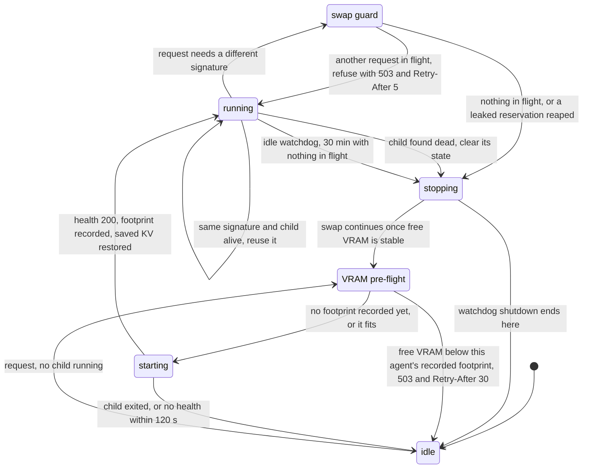
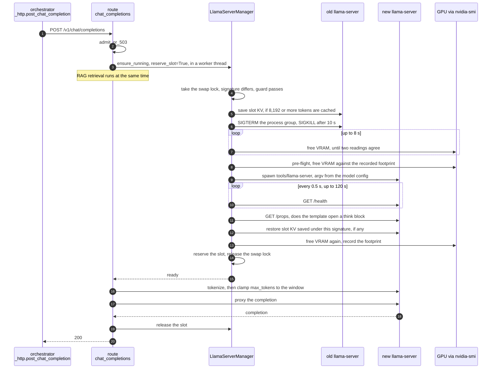

# How the inference server serves many agents on one GPU

Every agent in `Config.AGENTS` names a model config, and there is one GPU. The
server keeps **one** `llama-server` child process, with one model resident,
and swaps it when a request arrives for an agent whose model or runtime
differs. This page is how that swap is admitted, refused and carried out.

The code:

| Piece | Where |
|---|---|
| The child process, swaps, VRAM checks, the idle watchdog | `LlamaServerManager` in `coding_model_server/llama_server.py` |
| The request path, and how refusals become HTTP statuses | `chat_completions` in `coding_model_server/routes/chat.py` |
| The in-flight cap, and the manager singleton | `AdmissionController` and `llama_server_manager` in `coding_model_server/runtime.py` |
| The client side of a refusal | `post_chat_completion` in `coding_model_autonomous/_http.py` |
| Each agent's model config and the VRAM measurements behind it | `coding_model_server/roster.py` (the comment above each config) |

The knobs (`CODING_MODEL_CHAT_MAX_INFLIGHT`, `LLAMA_SERVER_REQUEST_TIMEOUT`,
`LLAMA_CACHE_RAM_MIB`, the `LLAMA_SLOT_SAVE*` variables,
`LLAMA_ORPHAN_SLOT_REAP_S`) and the per-model fields (`n_ctx`,
`n_gpu_layers`, `n_cpu_moe`, `n_cpu_ffn`, KV types) are in
[CONFIGURATION.md](CONFIGURATION.md). How the pipeline sees this contention
is in [PIPELINE.md](PIPELINE.md) section 2.

---

## 1. When a swap is needed

`ensure_running` compares the requested model config's **runtime signature**
with the running child's (`_runtime_signature`): the GGUF path, `n_ctx`,
`n_batch`, `n_ubatch`, `n_gpu_layers`, both KV types, `cpu_moe`,
`logit_bias`, `server_extra_args` and `draft`. The path alone is not enough,
because several agents share a GGUF with different runtimes, and a path-only
check once let the second agent run on the first one's config.

If the signature matches and the child is alive, the request reuses it, so two
agents that share one signature never swap between each other. Anything else
is a swap.

`n_cpu_moe` and `n_cpu_ffn` are not in the signature. Today no two agents
share a signature while differing in either, so nothing depends on it; an
agent added that way would silently run on the other's offload split.

---

## 2. Admission: the states a load passes through

The manager's `_state` has four values: `idle`, `starting`, `running` and
`stopping`. Two checks sit between them and decide whether a swap may happen
at all. Neither is a state in the code; they are drawn as states here because
each can send a request away.

**The swap guard** (`ensure_running`, then `_reap_orphaned_slots`). A swap
SIGTERMs the one shared child, so it must not happen under another agent's
live request. When another request is counted in flight the manager raises
`ModelBusyError`, which the route turns into a 503 with `Retry-After: 5`.
The one exception is a leaked reservation: a count with no proxy call
executing behind it for `LLAMA_ORPHAN_SLOT_REAP_S` (120 s), which is what a
request abandoned by a cancelled spec leaves. That count is reset and the
swap proceeds (DEV-582). A reservation with a live proxy is never reaped,
however long it runs. `coding-model-autonomous swap-reset` does the reset by
hand (DEV-583).

**The VRAM pre-flight** (`_check_vram_or_raise`). It runs after the old
child is gone, so it measures the freed state. The first load of an agent in
a process has no record and always proceeds. After a successful load the
manager records the drop in free VRAM as that agent's footprint, and later
loads are refused only when free VRAM is **below** that footprint:
`InsufficientVramError`, a 503 with `Retry-After: 30`. The 500 MiB
`_VRAM_MARGIN_MIB` on top of the footprint is advisory. Falling inside it
logs a warning and loads anyway, because demanding footprint plus margin can
be impossible on a card the model provably fits. The third refusal in a row
treats the record as suspect: it is cleared, and that load proceeds and
re-measures (DEV-156). A
measured drop larger than the whole card means another process allocated
between the two readings, and it is not recorded.

**The idle watchdog** (`_idle_watchdog`). It checks every 30 seconds and
stops the child after `IDLE_TIMEOUT` (30 minutes, not configurable) with
nothing in flight. A request in flight counts as activity. The watchdog
never waits on a swap; if one holds the swap lock, it leaves the teardown to
it.

Before either check, the route applies its own cap:
`AdmissionController.admit_or_503` allows `CODING_MODEL_CHAT_MAX_INFLIGHT`
(5) chat requests in flight or queued, and refuses the next with a 503 and
`Retry-After: 5`.

---

## 3. One swap, end to end

A request for an agent whose model is not loaded, with nothing else in
flight:

Three details the diagram compresses:

- **The reservation closes a race.** The slot is counted in flight before
  the swap lock is released (the "reserve the slot" step). Without that, a
  second agent's `ensure_running` could swap the child between "the right
  model is up" and this request's POST, and the request would get the other
  model's output (DEV-116). The route releases the slot exactly once, from the stream
  teardown or from its `finally`.
- **Why wait for VRAM to settle.** CUDA frees asynchronously. A child that
  starts the moment the old one is reaped can fail its compute-buffer
  allocation even though the old weights are gone (`_wait_for_vram_release`).
- **Saved KV skips a prefill.** With `LLAMA_SLOT_SAVE=1` the old child's slot
  is written to `var/kv_cache/` under a name derived from the full runtime
  signature, and restored when that exact runtime loads again, so a long
  prompt prefix does not have to be recomputed (DEV-408). A restore the
  server rejects deletes the file.

Before the spawn, `_reap_orphan_llama_server` kills a child left over from a
daemon that died hard, which would otherwise hold the port and answer
`/health` for the wrong model (DEV-157).

---

## 4. What the caller sees

The pipeline's client is `post_chat_completion` with `retry_5xx=True`, which
is how `_http.call_agent` and the planner call it.

| Status | Cause | What the client does |
|---|---|---|
| 503, `Retry-After: 5` | the in-flight cap, or the swap guard | Waits the interval and asks again. The wait does **not** use an attempt; it is bounded by the role's own call timeout (DEV-491) |
| 503, `Retry-After: 30` | the VRAM pre-flight | The same wait |
| 413 | the prompt leaves less of the window for output than `CODING_MODEL_MIN_COMPLETION_TOKENS`, or than the requested `max_tokens` if that is smaller (DEV-195) | Returned to the caller. The daemon classifies it as an `http_refusal` no-verdict with `rotate`, so the next dispatch goes to another agent without a charge |
| 502, "reasoning-only response" | the model spent its budget thinking and showed nothing (DEV-617) | Returned at once, not re-sent (DEV-760). Classified as `empty_completion` |
| 500, 502 or a transport error | the child died, or the server faulted | Retried on the 10, 30, 60 s schedule. Only these consume attempts |

A child that dies mid-request is restarted once by `_post_with_recovery`,
and the request is retried against the new child. A connection error with a
live child is not retried there.

The pipeline avoids most 413s before they happen: `context.plan_dispatch`
sums the prompt against each candidate agent's `n_ctx` and moves the
dispatch to a window that holds it (PIPELINE.md sections 7 and 8).
